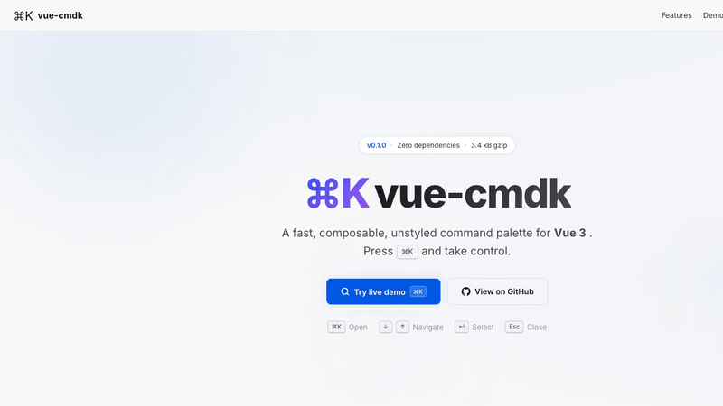

<p align="center">
  
  
  
  
</p>

<h1 align="center">⌘K — vue-cmdk</h1>
<p align="center">
  <b>A fast, composable, unstyled command palette for Vue 3.</b><br>
  Press <kbd>⌘K</kbd> and take control.
</p>

<p align="center">
  
</p>

## 🧠 Inspiration

This project is heavily inspired by two great projects:

| Project | Author | Description |
| --- | --- | --- |
| [`vue-command-palette`](https://github.com/xiaoluoboding/vue-command-palette) | [@xiaoluoboding](https://github.com/xiaoluoboding) | The first composable command palette for Vue, with 590 ★ |
| [`cmdk`](https://github.com/pacocoursey/cmdk) | [@pacocoursey](https://github.com/pacocoursey) | Fast, unstyled command menu React component (10k+ ★) |

### Why another one?

[`vue-command-palette`](https://github.com/xiaoluoboding/vue-command-palette) pioneered the ⌘K experience for Vue. Big thanks to [@xiaoluoboding](https://github.com/xiaoluoboding) for the original idea and work 🙌

However, the project has been **inactive since September 2023** — 9 issues remain unanswered, no dependencies have been updated in years, and the bundle size is 28 kB. The Vue ecosystem deserves a **well-maintained, lightweight alternative** that keeps up with modern standards.

**vue-cmdk** is built to fill that gap: same compound component API, zero dependencies, half the size, with full TypeScript support and a commitment to ongoing maintenance.

### vs vue-command-palette (legacy reference)

| Feature          |  `vue-command-palette`   |  `vue-cmdk`   |
| ---------------- | :----------------------: | :-----------: |
| 📦 Bundle (min)  |         28.2 kB          |  **11.8 kB**  |
| 📦 Bundle (gzip) |          9.6 kB          |  **3.4 kB**   |
| 🔍 Search        |   fuse.js (extra dep)    | **Built-in**  |
| 📋 TypeScript    |         Partial          |   **Full**    |
| 🔄 Async items   |            ❌            |      ✅       |
| 🧩 Custom filter |            ❌            |      ✅       |
| 🔒 Focus trap    |            ❌            |      ✅       |
| 🧹 Dependencies  | 3 (fuse.js, nanoid, ...) |     **0**     |
| 🔧 Maintenance   |  ❌ Inactive since 2023  | ✅ **Active** |

---

## ✨ Features

- **🧩 Compound component API** — `<Command.Dialog>`, `<Command.List>`, `<Command.Item>`, etc.
- **💄 Unstyled** — Bring your own CSS, zero opinions, full design control
- **🔍 Built-in search** — Fast case-insensitive filtering with keyword matching
- **⌨️ Keyboard-first** — Arrow keys, Enter, Escape — all built-in, no config needed
- **📦 Tiny** — 3.4 kB gzipped, **zero runtime dependencies** (peer: `vue` only)
- **🎯 TypeScript** — Full type inference and declaration files
- **🔄 Dynamic items** — Pass items as a reactive array, swap anytime
- **🛠 Custom filter** — Provide your own filter function
- **♿ Accessible** — ARIA attributes, focus trap, `aria-live` region

## 📊 Comparison with React cmdk

`vue-cmdk` is a Vue 3 port inspired by the excellent [`cmdk`](https://github.com/pacocoursey/cmdk) (React). Below is the current feature parity status:

| #   | Feature                                      |  React `cmdk`   |    `vue-cmdk`    |   Status   |
| --- | -------------------------------------------- | :-------------: | :--------------: | :--------: |
| 1   | `Command` root `value` / `onValueChange`     |       ✅        |        ❌        | 📋 Planned |
| 2   | `Command` root `shouldFilter`                |       ✅        |        ❌        | 📋 Planned |
| 3   | `Command` root `loop`                        |       ✅        |        ❌        | 📋 Planned |
| 4   | `Command` root `label` (aria-label)          |       ✅        |        ❌        | 📋 Planned |
| 5   | `Command.Dialog` `open` / `onOpenChange`     |    ✅ `open`    |   ✅ `visible`   |     ✅     |
| 6   | `Command.Dialog` `container` (portal target) |       ✅        |        ❌        | 💡 Future  |
| 7   | `Command.Input` `value` / `onValueChange`    |       ✅        | ✅ `searchQuery` |     ✅     |
| 8   | `Command.Item` `forceMount`                  |       ✅        |        ❌        | 📋 Planned |
| 9   | `Command.Item` `keywords`                    |       ✅        |        ✅        |     ✅     |
| 10  | `Command.Item` `onSelect`                    |       ✅        |        ✅        |     ✅     |
| 11  | `Command.Item` auto value from textContent   |       ✅        |        ❌        | 📋 Planned |
| 12  | `Command.Group` `forceMount`                 |       ✅        |        ❌        | 📋 Planned |
| 13  | `Command.Group` `heading`                    |       ✅        |        ✅        |     ✅     |
| 14  | `Command.Separator` `alwaysRender`           |       ✅        |        ❌        | 💡 Future  |
| 15  | `Command.Empty`                              |       ✅        |        ✅        |     ✅     |
| 16  | `Command.Loading`                            |       ✅        |        ✅        |     ✅     |
| 17  | `useCommandState()` state selector           |       ✅        |        ❌        | 📋 Planned |
| 18  | **Nested items / Pages**                     |  ✅ (pattern)   |        ❌        | 📋 Planned |
| 19  | **Built-in search / filtering**              |       ✅        |        ✅        |     ✅     |
| 20  | **Custom filter function**                   | ✅ (rank-based) | ✅ (item-based)  |     ✅     |
| 21  | **Global shortcut listener**                 |   ❌ (manual)   |  ✅ (built-in)   |  ✅ Bonus  |
| 22  | **Keyboard navigation**                      |       ✅        |        ✅        |     ✅     |
| 23  | **Focus trap**                               |   ✅ (Radix)    |   ✅ (custom)    |     ✅     |
| 24  | **Zero dependencies**                        |  ❌ (Radix UI)  |   ✅ (0 deps)    | ✅ Better  |
| 25  | **TypeScript**                               |       ✅        |        ✅        |     ✅     |
| 26  | **Unstyled**                                 |       ✅        |        ✅        |     ✅     |
| 27  | **Bundle size (gzip)**                       |      ~7 kB      |    **3.4 kB**    | ✅ Smaller |

> **Legend** — ✅ Done · 📋 High/Medium priority · 💡 Low priority / Nice to have

## 🚀 Install

```bash
npm install vue-command-kit
```

## Quick Start

### Simple — items prop

```vue
<script setup lang="ts">
  import { ref } from 'vue'
  import { Command } from 'vue-command-kit'
  import type { CommandItemData } from 'vue-command-kit'

  const visible = ref(false)

  const items: CommandItemData[] = [
    { value: 'settings', label: 'Open settings', shortcut: '⌘,' },
    { value: 'home', label: 'Go to home', shortcut: '⌘H' },
  ]

  function onSelect(item: CommandItemData) {
    console.log('selected:', item.value)
  }
</script>

<template>
  <button @click="visible = true">Open (⌘K)</button>

  <Command.Dialog
    :visible="visible"
    :items="items"
    @update:visible="visible = $event"
    @select="onSelect"
  />
</template>
```

### Advanced — custom slot content

```vue
<Command.Dialog :visible="visible" @update:visible="visible = $event">
  <template #header>
    <Command.Input placeholder="Search..." />
  </template>
  <template #body>
    <Command.List>
      <Command.Group heading="Favorites">
        <Command.Item value="home" label="Home" />
      </Command.Group>
    </Command.List>
  </template>
</Command.Dialog>
```

### With custom filter

```vue
<script setup lang="ts">
  import { Command } from 'vue-command-kit'

  function myFilter(items: CommandItemData[], query: string) {
    // Return filtered items, or null to use default filter
    return items.filter((item) => item.label?.includes(query))
  }
</script>

<template>
  <Command.Dialog
    :filter="myFilter"
    ...
  />
</template>
```

### With v-model:searchQuery

```vue
<script setup lang="ts">
  import { ref } from 'vue'
  import { Command } from 'vue-command-kit'
  import type { CommandItemData } from 'vue-command-kit'

  const visible = ref(false)
  const query = ref('')

  const items: CommandItemData[] = [
    { value: 'home', label: 'Home', keywords: ['dashboard'] },
    { value: 'settings', label: 'Settings' },
  ]
</script>

<template>
  <Command.Dialog
    :visible="visible"
    :items="items"
    v-model:searchQuery="query"
    @update:visible="visible = $event"
  />
</template>
```

### Async data + loading

```vue
<script setup lang="ts">
  import { ref, watch } from 'vue'
  import { Command } from 'vue-command-kit'
  import type { CommandItemData } from 'vue-command-kit'

  const visible = ref(false)
  const loading = ref(false)
  const items = ref<CommandItemData[]>([])

  watch(visible, async (v) => {
    if (v) {
      loading.value = true
      const data = await fetch('/api/commands').then((r) => r.json())
      items.value = data.map((d: any) => ({
        value: d.id,
        label: d.name,
        group: d.category,
      }))
      loading.value = false
    }
  })
</script>

<template>
  <Command.Dialog
    :visible="visible"
    :items="items"
    :loading="loading"
    @update:visible="visible = $event"
    @select="console.log('selected', $event)"
  />
</template>
```

## 📖 API

### `<Command.Dialog>` Props

| Prop            | Type                | Default               | Description                          |
| --------------- | ------------------- | --------------------- | ------------------------------------ |
| `visible`       | `boolean`           | `false`               | Controlled open state                |
| `items`         | `CommandItemData[]` | `[]`                  | Items to display                     |
| `searchQuery`   | `string`            | `''`                  | Search query (`v-model:searchQuery`) |
| `placeholder`   | `string`            | `'Type a command...'` | Input placeholder                    |
| `filter`        | `FilterFn`          | —                     | Custom filter function               |
| `loading`       | `boolean`           | `false`               | Show loading state                   |
| `autoFocus`     | `boolean`           | `true`                | Auto-focus input on open             |
| `closeOnSelect` | `boolean`           | `true`                | Close dialog after selection         |

### `<Command.Dialog>` Events

| Event                | Payload           | Description                       |
| -------------------- | ----------------- | --------------------------------- |
| `update:visible`     | `boolean`         | Emitted when visibility changes   |
| `update:searchQuery` | `string`          | Emitted when search query changes |
| `select`             | `CommandItemData` | Emitted when an item is selected  |

### Components

| Component             | Description                                    |
| --------------------- | ---------------------------------------------- |
| `<Command.Dialog>`    | Modal dialog with mask, transition, focus trap |
| `<Command.Menu>`      | Inline command menu (non-modal)                |
| `<Command.Input>`     | Search input with keyboard navigation          |
| `<Command.List>`      | Scrollable list rendering `groupedItems`       |
| `<Command.Group>`     | Group of items with heading                    |
| `<Command.Item>`      | Single selectable command item                 |
| `<Command.Empty>`     | Shown when no results match                    |
| `<Command.Separator>` | Visual separator                               |
| `<Command.Loading>`   | Loading indicator                              |

### `CommandItemData`

```ts
interface CommandItemData {
  value: string
  label?: string
  keywords?: string[]
  shortcut?: string
  group?: string
  disabled?: boolean
  icon?: Component
  onSelect?: (item: CommandItemData) => void
}
```

### `useCommandMenu()` Composable

```ts
import { useCommandMenu } from 'vue-command-kit'
import type { UseCommandMenuReturn, FilterFn } from 'vue-command-kit'

const menu: UseCommandMenuReturn = useCommandMenu(customFilter?)
menu.items.value = [...]
menu.open()
menu.close()
menu.toggle()
```

### Keyboard

| Key      | Action                                 |
| -------- | -------------------------------------- |
| `↑` `↓`  | Navigate items (wraps around)          |
| `Enter`  | Select current item                    |
| `Escape` | Close dialog                           |
| `Tab`    | Moves focus within dialog (focus trap) |

## 🤝 Contributing

### Prerequisites

- **Node.js** >= 22.13
- **pnpm** >= 11.x

### Setup

```bash
# Clone the repo
git clone https://github.com/yvng-jie/vue-cmdk.git
cd vue-cmdk

# Install dependencies
pnpm install

# Start demo dev server
pnpm dev
```

### Scripts

| Command           | Description                               |
| ----------------- | ----------------------------------------- |
| `pnpm dev`        | Start demo dev server at `localhost:5173` |
| `pnpm build`      | Build the library + type declarations     |
| `pnpm typecheck`  | Run TypeScript type checking              |
| `pnpm preview`    | Preview production build                  |
| `pnpm build:demo` | Build demo site to `dist-demo/`           |

### Project Structure

```
src/
├── useCommandMenu.ts     # core composable (state, filter, shortcuts)
├── useCommandRoot.ts     # shared composable (provide/inject wiring)
├── types.ts              # TypeScript type definitions
├── injectionKeys.ts      # provide/inject keys
├── utils/
│   └── injectStrict.ts   # type-safe inject helper
├── CommandMenu.vue       # inline command menu
├── CommandDialog.vue     # modal dialog command palette
├── CommandInput.vue      # search input
├── CommandList.vue       # scrollable filtered list
├── CommandGroup.vue      # group with heading
├── CommandItem.vue       # single selectable item
├── CommandEmpty.vue      # empty state
├── CommandSeparator.vue  # visual separator
├── CommandLoading.vue    # loading indicator
├── index.ts              # barrel exports
└── env.d.ts              # type shims
demo/
├── App.vue               # demo application
├── main.ts               # demo entry
└── style.css             # demo styles
```

### Pull Request Process

1. Fork the repo and create a feature branch from `main`
2. Make your changes and run `pnpm typecheck && pnpm build`
3. Test your changes with `pnpm dev` (demo app)
4. Update `CHANGELOG.md` with a description of your changes
5. Submit a PR with a clear description of what and why

PRs and issues are welcome!

## 📄 License

MIT © [yvng-jie](https://github.com/yvng-jie)

---

<p align="center">
  <sub>Made with ❤️ for the Vue community. Thanks to <a href="https://github.com/xiaoluoboding">@xiaoluoboding</a> for the original <a href="https://github.com/xiaoluoboding/vue-command-palette">vue-command-palette</a>.</sub>
</p>
